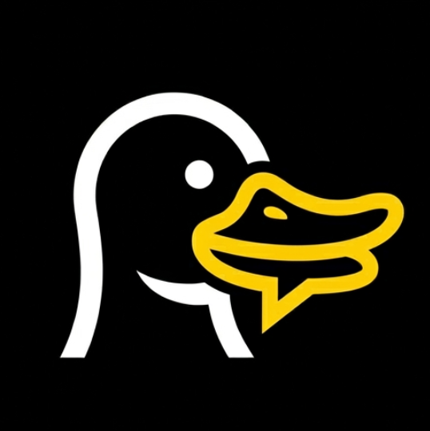
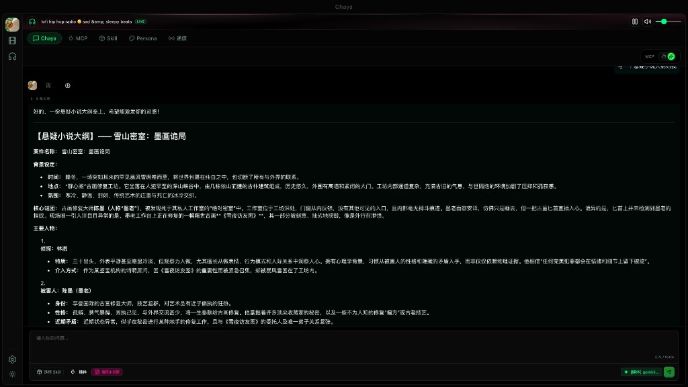
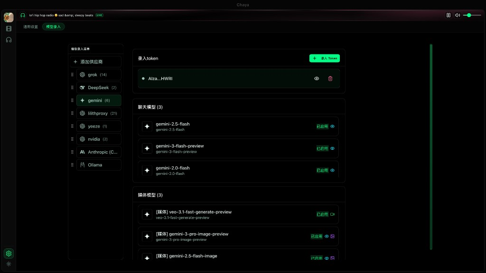
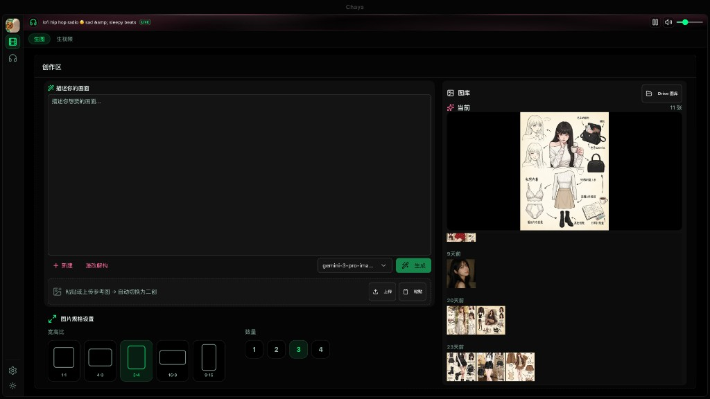
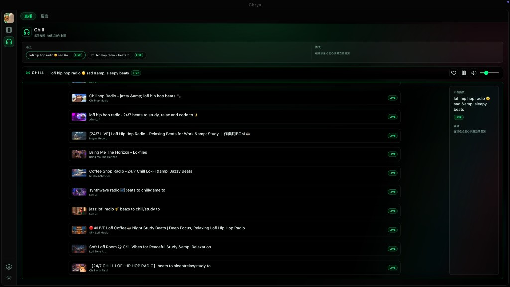

<p align="center">
  
</p>

<h1 align="center">Chaya</h1>

<p align="center">
  <strong>Your Chill AI Workspace</strong><br>
  <sub>Chat. Create. Chill. All in one place.</sub>
</p>

<p align="center">
  
  
  
  
  
</p>

<p align="center">
  <a href="#-at-a-glance">At a Glance</a>&ensp;·&ensp;
  <a href="#-features">Features</a>&ensp;·&ensp;
  <a href="#-getting-started">Getting Started</a>&ensp;·&ensp;
  <a href="#-architecture">Architecture</a>&ensp;·&ensp;
  <a href="#-contributing">Contributing</a>
</p>

---

## At a Glance

Chaya is a self-hosted AI workspace that brings together **intelligent chat**, **media creation**, and **ambient vibes** under a neon-noir cyberpunk interface. Connect your favorite LLMs, plug in MCP tools, define custom personas — and do it all with lofi beats playing in the background.

<p align="center">
  
</p>
<p align="center"><sub>Multi-agent chat with real-time thinking chains and MCP tool execution</sub></p>

---

## Features

### Chaya Chat — Multi-Model, Multi-Agent Conversations

Orchestrate conversations across GPT-4o, Claude, Gemini, DeepSeek, Grok, and local Ollama models. Run multi-agent roundtables, watch thinking chains unfold in real time, and let MCP tools handle the heavy lifting.

- **Multi-provider LLM** — OpenAI / Anthropic / Google / DeepSeek / Grok / Nvidia / Ollama
- **Multi-agent roundtable** — multiple AI actors collaborating in a single session
- **MCP tool integration** — auto-discovery, OAuth, real-time execution logs
- **Thinking chain visualization** — transparent reasoning, step by step
- **Skill packs** — reusable prompt-based capabilities attached to agents
- **TTS** — ElevenLabs-powered text-to-speech on any message
- **Discord bridge** — per-channel actors with independent memory

<p align="center">
  
</p>
<p align="center"><sub>Unified model registry — manage tokens, toggle models, one place</sub></p>

---

### Chatu — AI Media Studio

Generate images and videos with natural language. Paste reference images, pick aspect ratios, batch-generate variants, and push results straight to Google Drive.

- **Text-to-image / Image-to-image** — powered by Gemini, with more providers pluggable
- **Video generation** — Veo, Runway (expandable)
- **Gallery timeline** — browse outputs organized by date
- **Google Drive sync** — one-click upload to your cloud

<p align="center">
  
</p>
<p align="center"><sub>Describe your scene, pick a ratio, hit generate</sub></p>

---

### Chill — Ambient Radio

A built-in lofi / ambient radio that streams YouTube live stations. Browse, search, favorite — and keep the music playing while you work in any other tab. Because good vibes are not optional.

- **YouTube live streams** — curated lofi, jazz, synthwave, and more
- **Global player** — music persists across page navigation
- **Search & favorites** — build your own station list
- **Mini bar** — always-visible playback controls in the header

<p align="center">
  
</p>
<p align="center"><sub>Stay in the zone. Lofi beats never stop.</sub></p>

---

### Persona System

Define AI personalities with custom system prompts, voice presets, memory triggers, and behavioral toggles. Each persona is a full character profile — not just a system message.

### Niho Theme

A handcrafted neon cyberpunk design system. Pure black backgrounds, glowing green accents, mist-pink highlights, and a three-tier card elevation system built for focus.

---

## Getting Started

### Prerequisites

| Dependency | Version | Purpose |
|---|---|---|
| Node.js | 18+ | Frontend runtime |
| Python | 3.10+ | Backend runtime |
| MySQL | 8.0+ | Data storage |
| Redis | 6.0+ | Cache & messaging |

### Quick Start

```bash
git clone https://github.com/your-org/chaya.git
cd chaya

# Backend
cd backend
python -m venv venv && source venv/bin/activate
pip install -r requirements.txt
python app.py

# Frontend (new terminal)
cd front
pnpm install && pnpm dev
```

Open **http://localhost:5177** and you're in.

### Configuration

1. **Add LLM providers** — Settings > Model Registry > add your API keys
2. **Connect MCP servers** — Settings > MCP > paste server URLs
3. **Set up a persona** — Persona tab > create or import character profiles
4. **Start chatting** — pick an agent, pick a model, go

---

## Architecture

```
chaya/
├── backend/                 # Flask API server
│   ├── api/                 # REST endpoints
│   ├── services/
│   │   ├── actor/           # Agent actor model & lifecycle
│   │   ├── providers/       # LLM provider adapters
│   │   ├── mcp/             # MCP client & auto-selection
│   │   ├── chill/           # YouTube ambient service
│   │   └── media/           # Image & video generation
│   └── app.py
│
├── front/                   # React 19 + Vite 7 + TypeScript
│   └── src/
│       ├── components/      # UI — Workflow, Chatu, Chill, Agents...
│       ├── services/        # API clients, context, state
│       └── index.css        # Niho design system tokens
│
├── docs/                    # Additional documentation
└── electron/                # Electron shell (experimental)
```

**Frontend**: React 19, Vite 7, TypeScript, Tailwind CSS, Radix UI, MCP SDK

**Backend**: Flask, Python 3.10+, MySQL, Redis, Actor-based agent runtime

---

## Contributing

Contributions welcome. Fork, branch, PR — the usual flow.

```bash
git checkout -b feature/your-idea
git commit -m "add: your idea"
git push origin feature/your-idea
```

Then open a Pull Request.

---

## License

[MIT](LICENSE)

---

<p align="center">
  <sub>Built with good vibes and too much coffee.</sub>
</p>
