# ChatAgent MCP 处理流程

## 调用流程图

```mermaid
graph TB
    Start([用户发送消息]) --> Receive[接收消息<br/>_handle_new_message]
    
    Receive --> CheckDup{是否已处理?}
    CheckDup -->|是| End1([结束])
    CheckDup -->|否| AppendHistory[追加到历史<br/>state.append_history]
    
    AppendHistory --> CheckSelf{是否自己的消息?}
    CheckSelf -->|是| End2([结束])
    CheckSelf -->|否| CheckMemory{检查记忆预算}
    
    CheckMemory -->|超过阈值| Summarize[生成摘要<br/>_summarize_memory]
    Summarize --> Decision
    CheckMemory -->|未超过| Decision[决策是否响应<br/>_should_respond]
    
    Decision -->|silent| Silent[处理沉默决策]
    Decision -->|delegate| Delegate[处理委托决策]
    Decision -->|like/oppose/ask_human| Special[处理特殊动作]
    Decision -->|reply| Process[开始处理消息<br/>process_message]
    
    Process --> CreateContext[创建迭代上下文<br/>IterationContext]
    CreateContext --> NotifyStart[通知前端: agent_thinking]
    
    NotifyStart --> IterateLoop{迭代循环<br/>while not complete}
    
    IterateLoop --> Plan[规划行动<br/>_plan_actions]
    
    Plan --> CheckMCP{检查消息ext中<br/>是否有MCP服务器?}
    CheckMCP -->|有| CreateMCPActions[为每个MCP服务器<br/>创建Action.mcp]
    CheckMCP -->|无| NoActions[无行动]
    
    CreateMCPActions --> ExecuteAction[执行行动<br/>_execute_action]
    NoActions --> MarkComplete[标记完成]
    
    ExecuteAction --> ActionType{行动类型?}
    ActionType -->|mcp| CallMCP[调用MCP<br/>_call_mcp]
    ActionType -->|skill| CallSkill[调用Skill]
    ActionType -->|tool| CallTool[调用工具]
    ActionType -->|llm| CallLLM[调用LLM]
    
    CallMCP --> AddStep[添加处理步骤<br/>mcp_call]
    AddStep --> GetTools[获取MCP工具列表<br/>_get_mcp_tools_description]
    
    GetTools --> QueryDB[查询数据库<br/>获取MCP服务器URL]
    QueryDB --> GetToolsList[调用get_mcp_tools_list<br/>获取工具列表]
    GetToolsList --> FormatTools[格式化工具描述]
    
    FormatTools --> BuildContext[构建MCP上下文<br/>_build_mcp_context]
    BuildContext --> GetHistory[获取最近6条历史消息]
    GetHistory --> FormatHistory[格式化历史为文本]
    
    FormatHistory --> DetermineLLM[确定使用的LLM配置]
    DetermineLLM --> CheckUserLLM{用户是否选择LLM?}
    CheckUserLLM -->|是| UseUserLLM[使用用户选择的LLM]
    CheckUserLLM -->|否| UseDefaultLLM[使用Agent默认LLM]
    
    UseUserLLM --> BuildInput[构建输入文本]
    UseDefaultLLM --> BuildInput
    
    BuildInput --> CombineInput[组合输入:<br/>工具描述+历史+当前请求]
    CombineInput --> GetPersona[获取Agent人设<br/>system_prompt]
    
    GetPersona --> ExecuteMCP[执行MCP<br/>execute_mcp_with_llm]
    
    ExecuteMCP --> InitMCP[初始化MCP会话<br/>initialize_mcp_session]
    InitMCP --> GetMCPTools[获取MCP工具列表<br/>tools/list]
    GetMCPTools --> BuildToolDesc[构建工具描述<br/>包含完整参数schema]
    
    BuildToolDesc --> LLMSelect[LLM选择工具和参数<br/>chat_completion]
    LLMSelect --> ParseJSON[解析LLM返回的JSON]
    
    ParseJSON --> ExecuteTools[执行选中的工具<br/>tools/call]
    ExecuteTools --> CollectResults[收集工具执行结果]
    
    CollectResults --> CheckError{是否有错误?}
    CheckError -->|有| HandleError[处理错误]
    CheckError -->|无| ExtractMedia[提取媒体数据]
    
    HandleError --> SendErrorMsg[发送错误提示消息<br/>触发Agent自处理]
    SendErrorMsg --> ReturnError[返回错误结果]
    
    ExtractMedia --> BuildSummary[构建摘要和工具文本]
    BuildSummary --> UpdateStep[更新步骤状态: completed]
    UpdateStep --> AppendResult[追加工具结果到上下文]
    AppendResult --> ReturnSuccess[返回成功结果]
    
    ReturnError --> CheckContinue
    ReturnSuccess --> CheckContinue{是否继续迭代?<br/>_should_continue}
    
    CheckContinue -->|是| IterateLoop
    CheckContinue -->|否| GenerateResponse[生成最终回复<br/>_generate_final_response]
    
    GenerateResponse --> BuildSystemPrompt[构建系统提示词<br/>_build_system_prompt]
    BuildSystemPrompt --> BuildMessages[构建LLM消息列表<br/>_build_llm_messages]
    
    BuildMessages --> AddSummary[添加摘要]
    AddSummary --> AddHistory[添加历史消息]
    AddHistory --> AddToolResults[添加工具结果]
    AddToolResults --> AddUserMsg[添加用户消息]
    
    AddUserMsg --> StreamLLM[流式调用LLM<br/>_stream_llm_response]
    StreamLLM --> SendChunks[发送流式chunk<br/>agent_stream_chunk]
    
    SendChunks --> SaveMessage[保存最终消息<br/>send_message]
    SaveMessage --> AppendToHistory[追加到本地历史]
    AppendToHistory --> SendDone[发送完成事件<br/>agent_stream_done]
    
    SendDone --> End3([结束])
    
    Silent --> End4([结束])
    Delegate --> End5([结束])
    Special --> End6([结束])
    MarkComplete --> GenerateResponse
    
    style CallMCP fill:#e1f5ff
    style ExecuteMCP fill:#fff4e1
    style LLMSelect fill:#ffe1f5
    style ExecuteTools fill:#e1ffe1
    style GenerateResponse fill:#f5e1ff
```



## 关键方法说明

### 1. 消息接收层 (`actor_base.py`)

#### `_handle_new_message` (415-451行)
- 接收新消息
- 去重检查
- 追加到历史
- 检查记忆预算
- 决策是否响应

#### `process_message` (453-525行)
- 创建迭代上下文 `IterationContext`
- 提取用户选择的LLM配置
- 通知前端开始处理
- 进入迭代循环

### 2. 规划层 (`chat_agent.py`)

#### `_plan_actions` (228-266行)
- 检查消息 `ext` 中的 `mcp_servers` / `selectedMcpServerIds`
- 为每个MCP服务器创建 `Action.mcp` 对象
- 最多支持3个MCP服务器

### 3. 执行层 (`actor_base.py`)

#### `_execute_action` (587-622行)
- 根据 `action.type` 分发到对应的处理方法
- `mcp` → `_call_mcp`
- `skill` → `_call_skill`
- `tool` → `_call_tool`
- `llm` → `_call_llm`

#### `_call_mcp` (702-996行)
**核心MCP调用逻辑：**

1. **添加处理步骤** (728-733行)
   - 添加 `mcp_call` 步骤到上下文
   - 不立即发送实时更新（加速MCP过程）

2. **确定LLM配置** (744-810行)
   - 优先级：用户选择的配置ID > 用户选择的模型 > Agent默认配置
   - 查询数据库验证配置存在性

3. **获取工具描述** (816-819行)
   - 调用 `_get_mcp_tools_description`
   - 从数据库获取MCP服务器URL
   - 调用 `get_mcp_tools_list` 获取工具列表
   - 格式化工具描述（包含完整信息）

4. **构建上下文** (822-823行)
   - 调用 `_build_mcp_context`
   - 获取最近6条历史消息
   - 格式化为文本

5. **构建输入** (825-834行)
   - 组合：工具描述 + 历史上下文 + 当前请求
   - 获取Agent人设作为系统提示词

6. **执行MCP** (842-848行)
   - 调用 `execute_mcp_with_llm`
   - 传递：服务器ID、输入文本、LLM配置ID、Agent人设、原始消息

7. **处理结果** (855-981行)
   - 检查错误，如有则发送错误提示消息触发Agent自处理
   - 提取媒体数据（图片等）
   - 更新步骤状态
   - 追加工具结果到上下文

#### `_get_mcp_tools_description` (998-1072行)
- 查询数据库获取MCP服务器URL
- 准备请求头（OAuth等）
- 调用 `get_mcp_tools_list` 获取工具列表
- 格式化工具描述为易读文本

#### `_build_mcp_context` (1074-1110行)
- 获取最近N条历史消息（默认6条）
- 格式化为 "用户: xxx\n助手: xxx" 格式
- 截断过长内容（>500字符）

### 4. MCP执行服务层 (`mcp_execution_service.py`)

#### `execute_mcp_with_llm` (654-1657行)
**两步法执行MCP：**

1. **初始化** (742-792行)
   - 获取LLM配置（验证完整性）
   - 获取MCP服务器配置
   - 准备请求头（OAuth token等）
   - 初始化MCP会话（如需要）

2. **获取工具列表** (794-821行)
   - 调用 `tools/list` 接口
   - 构建工具描述（包含完整参数schema）

3. **LLM选择工具** (852-1050行)
   - 构建提示词：工具描述 + 用户输入 + Agent人设
   - 调用LLM的 `chat_completion`
   - 解析LLM返回的JSON（工具选择和参数）

4. **执行工具** (1052-1400行)
   - 遍历LLM选择的工具
   - 调用 `tools/call` 接口
   - 收集执行结果
   - 处理错误（网络错误、业务错误等）

5. **生成摘要** (1402-1657行)
   - 将工具执行结果发送给LLM生成摘要
   - 返回：summary、tool_text、results、media、error

### 5. 回复生成层 (`actor_base.py`)

#### `_generate_final_response` (1297-1440行)
- 构建系统提示词（包含能力描述、历史提示、工具结果提示）
- 构建消息列表（摘要 + 历史 + 工具结果 + 用户消息）
- 流式调用LLM生成回复
- 保存消息并发送完成事件

## 数据流

```
用户消息 (ext.mcp_servers)
    ↓
_plan_actions → Action.mcp(server_id, tool_name='auto')
    ↓
_execute_action → _call_mcp
    ↓
_get_mcp_tools_description → 工具列表描述
_build_mcp_context → 历史上下文
    ↓
execute_mcp_with_llm
    ↓
LLM选择工具 → tools/call → 工具结果
    ↓
ActionResult (success/error, data, text_result)
    ↓
ctx.executed_results.append(result)
    ↓
_generate_final_response
    ↓
LLM生成最终回复
```

## 关键特性

1. **迭代式处理**：支持多轮迭代，每轮可以执行多个MCP调用
2. **上下文传递**：MCP调用时传递历史对话和工具描述
3. **错误自处理**：MCP错误时自动发送消息触发Agent处理
4. **媒体提取**：从MCP结果中提取图片等媒体数据
5. **LLM配置优先级**：用户选择 > Agent默认配置
6. **流式响应**：最终回复采用流式生成，实时反馈给前端

## 调用时序图

```
用户 → ChatAgent._handle_new_message
    → ChatAgent._should_respond (决策)
    → ActorBase.process_message
        → ChatAgent._plan_actions (规划MCP行动)
        → ActorBase._iterate
            → ActorBase._execute_action
                → ActorBase._call_mcp
                    → ActorBase._get_mcp_tools_description
                    → ActorBase._build_mcp_context
                    → mcp_execution_service.execute_mcp_with_llm
                        → mcp_common_logic.initialize_mcp_session
                        → mcp_common_logic.get_mcp_tools_list
                        → llm_service.chat_completion (选择工具)
                        → mcp_common_logic.call_mcp_tool (执行工具)
                        → llm_service.chat_completion (生成摘要)
                    → 返回 ActionResult
            → ActorBase._should_continue (判断是否继续)
        → ActorBase._generate_final_response
            → ActorBase._build_system_prompt
            → ActorBase._build_llm_messages
            → ActorBase._stream_llm_response
            → topic_service.send_message (保存消息)
```
