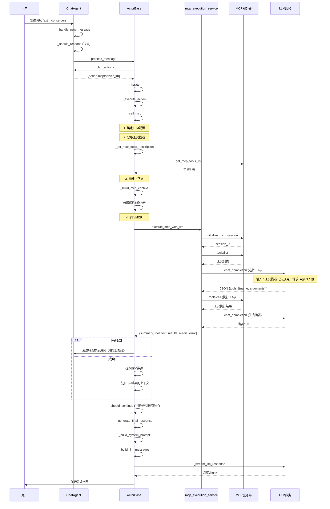

# ChatAgent MCP 处理流程（简化版）

## 双流程架构

系统支持两种消息处理流程，通过 `USE_NEW_PROCESS_FLOW` 或 `ext.use_new_flow` 控制：

- **V1 流程（默认）**：迭代器模式，兼容现有逻辑
- **V2 流程（新版）**：事件驱动模式，更细粒度的步骤控制

## V1 核心调用链（旧版迭代器模式）

```
┌─────────────────────────────────────────────────────────────────┐
│  1. 消息接收层                                                    │
│     _handle_new_message → process_message                        │
└─────────────────────────────────────────────────────────────────┘
                            ↓
┌─────────────────────────────────────────────────────────────────┐
│  2. 规划层 (ChatAgent)                                            │
│     _plan_actions                                                 │
│     ├─ 检查 ext.mcp_servers / selectedMcpServerIds              │
│     └─ 创建 Action.mcp(server_id, tool_name='auto')              │
└─────────────────────────────────────────────────────────────────┘
                            ↓
┌─────────────────────────────────────────────────────────────────┐
│  3. 执行层 (ActorBase)                                            │
│     _execute_action → _call_mcp                                   │
│     ├─ 确定LLM配置（用户选择 > Agent默认）                        │
│     ├─ _get_mcp_tools_description                                │
│     │   └─ 查询DB → get_mcp_tools_list → 格式化工具描述         │
│     ├─ _build_mcp_context                                         │
│     │   └─ 获取最近6条历史 → 格式化为文本                         │
│     └─ execute_mcp_with_llm                                      │
└─────────────────────────────────────────────────────────────────┘
                            ↓
┌─────────────────────────────────────────────────────────────────┐
│  4. MCP执行服务层 (mcp_execution_service)                         │
│     execute_mcp_with_llm                                         │
│     ├─ 初始化MCP会话 (initialize_mcp_session)                    │
│     ├─ 获取工具列表 (tools/list)                                 │
│     ├─ LLM选择工具 (chat_completion)                             │
│     │   └─ 输入：工具描述 + 历史 + 用户请求 + Agent人设          │
│     ├─ 执行工具 (tools/call)                                      │
│     └─ LLM生成摘要 (chat_completion)                              │
│     └─ 返回：{summary, tool_text, results, media, error}         │
└─────────────────────────────────────────────────────────────────┘
                            ↓
┌─────────────────────────────────────────────────────────────────┐
│  5. 结果处理层 (ActorBase._call_mcp)                             │
│     ├─ 检查错误 → 发送错误提示消息（触发Agent自处理）            │
│     ├─ 提取媒体数据 (图片等)                                      │
│     ├─ 更新步骤状态                                              │
│     └─ 追加工具结果到 ctx.tool_results_text                      │
└─────────────────────────────────────────────────────────────────┘
                            ↓
┌─────────────────────────────────────────────────────────────────┐
│  6. 回复生成层 (ActorBase)                                        │
│     _generate_final_response                                      │
│     ├─ _build_system_prompt (包含能力描述、工具结果提示)         │
│     ├─ _build_llm_messages (摘要+历史+工具结果+用户消息)        │
│     └─ _stream_llm_response (流式生成回复)                       │
└─────────────────────────────────────────────────────────────────┘
```

## V2 核心调用链（新版事件驱动模式）

```
┌─────────────────────────────────────────────────────────────────┐
│  1. 消息接收层                                                    │
│     _handle_new_message → process_message_v2                     │
│     ├─ 检查 ext.use_new_flow 或 USE_NEW_PROCESS_FLOW            │
│     └─ 选择 V1 或 V2 流程                                        │
└─────────────────────────────────────────────────────────────────┘
                            ↓
┌─────────────────────────────────────────────────────────────────┐
│  2. loadLLMAndTool - 加载LLM配置和MCP工具                        │
│     _load_llm_and_tools                                          │
│     ├─ 确定LLM配置（用户选择 > Agent默认）                       │
│     ├─ 从消息 ext 提取 MCP 服务器列表                            │
│     ├─ _get_mcp_tools_for_server (获取工具列表)                  │
│     └─ ctx.set_llm_config / ctx.set_mcp_tools                    │
│     └─ → Cast Topic.Event.Process (load_llm_tool)                │
└─────────────────────────────────────────────────────────────────┘
                            ↓
┌─────────────────────────────────────────────────────────────────┐
│  3. prepareContextMessage - 准备上下文消息                        │
│     _prepare_context_message                                     │
│     ├─ 检查 token 上限（MEMORY_BUDGET_THRESHOLD）                │
│     ├─ 如果超限：_summarize_memory_with_keep (保留最近5条)       │
│     ├─ _build_system_prompt                                       │
│     └─ ctx.set_context (system_prompt, history_messages)         │
│     └─ → Cast Topic.Event.Process (prepare_context)              │
└─────────────────────────────────────────────────────────────────┘
                            ↓
┌─────────────────────────────────────────────────────────────────┐
│  4. msgtypeclassify - 消息类型分类                               │
│     _classify_msg_type                                           │
│     ├─ agent_msg: sender_type='agent' && chain_append/auto_trigger│
│     ├─ agent_toolcall_msg: ext.tool_call 存在且有效              │
│     └─ user_new_msg: 默认（用户新消息）                          │
│     └─ → Cast Topic.Event.Process (msg_type_classify)            │
└─────────────────────────────────────────────────────────────────┘
                            ↓
┌─────────────────────────────────────────────────────────────────┐
│  5. msg_pre_deal - 消息预处理                                    │
│     _msg_pre_deal                                                │
│     ├─ agent_msg from self: 跳过（返回 False）                   │
│     ├─ agent_toolcall_msg: 执行 MCP 调用                         │
│     │   ├─ 提取 tool_call (server_id, tool_name, params)        │
│     │   ├─ _call_mcp (执行工具)                                  │
│     │   └─ ctx.set_result_msg (存储结果)                         │
│     └─ user_new_msg: 直接通过                                    │
│     └─ → Cast Topic.Event.Process (msg_pre_deal)                 │
└─────────────────────────────────────────────────────────────────┘
                            ↓
┌─────────────────────────────────────────────────────────────────┐
│  6. msg_deal - 消息处理（LLM调用）                               │
│     _msg_deal                                                    │
│     ├─ _build_llm_input_for_msg_deal                             │
│     │   └─ 构建带消息类型标记的输入                              │
│     ├─ LLM chat_completion (非流式，获取决策)                    │
│     └─ _parse_llm_decision                                       │
│         ├─ continue: 需要工具调用，提取 next_tool_call           │
│         └─ complete: 处理完毕，提取回复内容                      │
│     └─ → Cast Topic.Event.Process (msg_deal)                     │
└─────────────────────────────────────────────────────────────────┘
                            ↓
┌─────────────────────────────────────────────────────────────────┐
│  7. post_msg_deal - 消息后处理                                   │
│     _post_msg_deal                                               │
│     ├─ 如果 decision=continue && next_tool_call:                 │
│     │   └─ 发送工具调用消息到 Topic（触发新消息循环）            │
│     └─ 如果 decision=complete:                                   │
│         ├─ 解析媒体（mcp_media + final_media）                   │
│         ├─ 构建 ext_data                                         │
│         └─ send_message (发送最终回复)                           │
│     └─ → Cast Topic.Event.Process (post_msg_deal)                │
└─────────────────────────────────────────────────────────────────┘
```

## 详细流程图



## 关键数据结构

### Action.mcp
```python
Action.mcp(
    server_id="mcp_server_123",
    tool_name="auto",  # 自动选择
    params={"input": "用户请求内容"},
    timeout_ms=60000
)
```

### IterationContext（V1 + V2 扩展）
```python
# 基础字段（V1）
ctx = IterationContext(
    original_message={...},       # 原始用户消息
    tool_results_text="...",      # 工具执行结果文本
    mcp_media=[...],              # MCP返回的媒体数据
    executed_results=[...],       # 已执行的行动结果
    user_selected_llm_config_id,  # 用户选择的LLM配置
)

# V2 扩展字段
ctx.llm_config = {...}            # LLM 配置详情
ctx.llm_config_id = "..."         # LLM 配置 ID
ctx.mcp_tools = [...]             # MCP 工具列表（结构化）
ctx.mcp_server_ids = [...]        # MCP 服务器 ID 列表
ctx.system_prompt = "..."         # 构建好的 System Prompt
ctx.history_messages = [...]      # 准备好的历史消息
ctx.msg_type = "user_new_msg"     # 消息类型分类结果
ctx.result_msg = {...}            # 工具调用结果消息
ctx.event_states = {...}          # 各阶段状态
ctx.current_phase = "msg_deal"    # 当前处理阶段
ctx.llm_decision = "complete"     # LLM 决策结果
ctx.llm_decision_data = {...}     # 决策附加数据
ctx.should_continue = False       # 是否需要继续处理
ctx.next_tool_call = {...}        # 下一个工具调用参数
```

### 消息类型常量（MessageType）
```python
class MessageType:
    USER_NEW_MSG = 'user_new_msg'           # 用户新消息
    AGENT_MSG = 'agent_msg'                  # Agent 链式追加消息
    AGENT_TOOLCALL_MSG = 'agent_toolcall_msg'  # Agent 工具调用请求
    RESULT_MSG = 'result_msg'                # 工具调用结果消息
```

### 处理阶段常量（ProcessPhase）
```python
class ProcessPhase:
    LOAD_LLM_TOOL = 'load_llm_tool'
    PREPARE_CONTEXT = 'prepare_context'
    MSG_TYPE_CLASSIFY = 'msg_type_classify'
    MSG_PRE_DEAL = 'msg_pre_deal'
    MSG_DEAL = 'msg_deal'
    POST_MSG_DEAL = 'post_msg_deal'
```

### LLM 决策类型（LLMDecision）
```python
class LLMDecision:
    CONTINUE = 'continue'    # 继续处理（触发新消息处理）
    COMPLETE = 'complete'    # 处理完毕
```

### ActionResult
```python
ActionResult(
    success=True/False,
    action_type="mcp",
    data={...},              # MCP执行结果
    text_result="...",       # 文本结果
    error="...",             # 错误信息
    duration_ms=1234
)
```

### execute_mcp_with_llm 返回
```python
{
    "summary": "工具执行摘要",
    "tool_text": "详细工具结果",
    "results": [
        {
            "tool": "tool_name",
            "success": True,
            "content": "...",
            "error": None
        }
    ],
    "media": [
        {
            "type": "image",
            "mimeType": "image/png",
            "data": "base64..."
        }
    ],
    "error": None
}
```

## 关键配置优先级

### LLM配置选择
```
1. ext.user_llm_config_id (用户直接选择配置ID)
   ↓ (如果与默认不同)
2. ext.model → _find_llm_config_for_model (用户选择模型名称)
   ↓ (如果找到)
3. session.llm_config_id (Agent默认配置)
```

### MCP服务器选择
```
从消息 ext 中提取：
- ext.mcp_servers
- ext.selectedMcpServerIds
- ext.selected_mcp_server_ids

最多支持3个MCP服务器并行调用
```

## 错误处理流程

```
MCP执行错误
    ↓
检查错误类型
    ├─ network (网络错误)
    ├─ business (业务错误)
    └─ other (其他错误)
    ↓
发送错误提示消息到Topic
    ↓
ext.auto_trigger = True
ext.mcp_error = True
    ↓
触发Agent自处理（_should_respond检测到auto_trigger）
    ↓
Agent生成错误分析和解决方案
```

## 事件类型（TopicEventType）

```python
# 消息相关
NEW_MESSAGE = 'new_message'
MESSAGES_ROLLED_BACK = 'messages_rolled_back'

# Topic 状态
TOPIC_UPDATED = 'topic_updated'
TOPIC_PARTICIPANTS_UPDATED = 'topic_participants_updated'

# 参与者状态
AGENT_JOINED = 'agent_joined'
PARTICIPANT_LEFT = 'participant_left'

# Agent 状态
AGENT_RECEIVED = 'agent_received'
AGENT_DECIDING = 'agent_deciding'
AGENT_DECISION_MADE = 'agent_decision_made'
AGENT_THINKING = 'agent_thinking'
AGENT_STREAM_CHUNK = 'agent_stream_chunk'
AGENT_STREAM_DONE = 'agent_stream_done'
AGENT_SILENT = 'agent_silent'

# V2 处理流程事件
PROCESS_EVENT = 'process_event'  # Topic.Event.Process 统一事件
```

### Process Event 数据结构
```python
{
    'phase': 'load_llm_tool',     # 处理阶段
    'agent_id': 'agent_xxx',      # Agent ID
    'agent_name': 'Agent Name',   # Agent 名称
    'agent_avatar': '...',        # Agent 头像
    'status': 'running',          # 状态: running/completed/error
    'timestamp': 1234567890.0,    # 时间戳
    # 阶段特定数据...
    'event_data': {               # 完整的上下文数据
        'topic_id': '...',
        'message_id': '...',
        'current_phase': '...',
        'msg_type': '...',
        'llm_decision': '...',
        'process_steps': [...],
        'is_complete': False,
        'error': None,
    }
}
```

## 如何启用 V2 流程

### 方式 1：通过消息 ext 启用（单次）
```json
{
    "content": "用户消息",
    "ext": {
        "use_new_flow": true
    }
}
```

### 方式 2：通过 Agent 类属性启用（全局）
```python
class MyAgent(ChatAgent):
    USE_NEW_PROCESS_FLOW = True  # 默认使用 V2 流程
```

## 性能优化点

1. **跳过实时更新**：MCP调用时不立即发送步骤更新，等待完成后再发送
2. **工具列表缓存**：`get_mcp_tools_list` 支持缓存（但Actor场景优先不走缓存）
3. **历史截断**：只传递最近6条历史消息给MCP
4. **内容截断**：单条消息超过500字符时截断
5. **并行限制**：最多3个MCP服务器并行调用
6. **Token预算**：V2 流程自动检测并在超限时触发 summary（保留最近5条）
