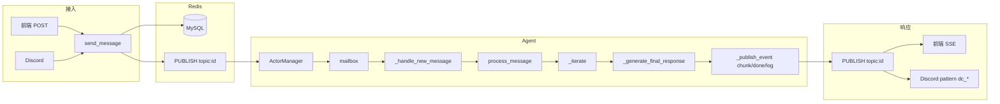

# 从接受到响应的完整流程

本文描述「用户发消息 → 持久化与 Redis 分发 → Agent 处理 → 流式响应下发」的整条链路。  
当前后端**仅使用一套**处理流程：`process_message`（迭代器模式）。新流程 `process_message_v2` 已停用。

---

## 总览（五阶段）

```
┌─────────────────────────────────────────────────────────────────────────────────┐
│  阶段一：消息接入                                                                  │
│  前端 POST /api/sessions/<id>/messages 或 Discord → 请求体/参数                   │
└───────────────────────────────────────────┬─────────────────────────────────────┘
                                            ▼
┌─────────────────────────────────────────────────────────────────────────────────┐
│  阶段二：持久化 + Redis 分发                                                       │
│  TopicService.send_message → MySQL 落库 → _publish_event(topic_id, 'new_message') │
│  → Redis PUBLISH channel "topic:{topic_id}"                                       │
└───────────────────────────────────────────┬─────────────────────────────────────┘
                                            ▼
┌─────────────────────────────────────────────────────────────────────────────────┐
│  阶段三：Agent 订阅与收取（由 ActorManager 统一管理映射与按需激活）                  │
│  ActorManager 使用 psubscribe("topic:*") 监听 → 收到 new_message 时若该 channel   │
│  尚无 agent，则按 DB 解析 topic→agent_ids 并激活、再分发 → actor.on_event →       │
│  mailbox → run_loop → _handle_new_message                                        │
└───────────────────────────────────────────┬─────────────────────────────────────┘
                                            ▼
┌─────────────────────────────────────────────────────────────────────────────────┐
│  阶段四：Agent 处理（唯一流程）                                                    │
│  _handle_new_message → process_message → _iterate（_plan_actions → _execute_   │
│  action → _call_mcp 等）→ _generate_final_response → 流式 LLM 生成                 │
└───────────────────────────────────────────┬─────────────────────────────────────┘
                                            ▼
┌─────────────────────────────────────────────────────────────────────────────────┐
│  阶段五：响应下发                                                                  │
│  Actor 发布 agent_stream_chunk / agent_stream_done / execution_log 到同一 topic   │
│  → 前端 SSE /api/topics/<id>/stream 收到并渲染；Discord 订阅 topic:dc_* 发回频道   │
└─────────────────────────────────────────────────────────────────────────────────┘
```

---

## 阶段一：消息接入

两条入口都只调用 **TopicService.send_message**；**不再由调用方先激活 Agent**，由阶段三的 ActorManager 在收到 Redis 消息时按需激活。

| 来源 | 入口 | 行为 |
|------|------|------|
| **前端 Chaya** | `POST /api/sessions/<session_id>/messages`（或 `/api/topics/.../messages`） | 直接 `get_topic_service().send_message(topic_id=session_id, ...)`。 |
| **Discord 机器人** | 用户在某频道发消息 → `DiscordService._on_message` → `_dispatch_to_actor(...)` | 直接 `topic_svc.send_message(...)`；不在此处调用 `activate_agent`。 |

---

## 阶段二：持久化与 Redis 分发

**TopicService.send_message** 做两件事：

1. **持久化**：把消息写入 MySQL `messages` 表，并更新 `sessions.last_message_at`。
2. **发布事件**：`_publish_event(topic_id, 'new_message', message_data)`。

**Redis 发布**（`TopicService._publish_event`）：

- **频道**：`channel = "topic:{topic_id}"`（例如 `topic:agent_chaya`、`topic:dc_xxx`）。
- **载荷**：`{ "type": "new_message", "data": message_data }`，其中 `message_data` 含 `message_id`、`topic_id`、`sender_id`、`content`、`ext` 等。
- **方式**：`redis_client.publish(channel, json.dumps(payload))`。

同一 topic 下后续的 Agent 回复事件（如 `agent_stream_chunk`、`agent_stream_done`、`execution_log`）也通过同一 `_publish_event(topic_id, event_type, data)` 发到 **同一频道** `topic:{topic_id}`。

---

## 阶段三：Agent 订阅与收取（ActorManager 统一管理映射与激活/销毁）

**线程模型**

- **ActorManager** 与 **Actor** 不在同一线程：Manager 运行在**独立的后台线程**（Redis 监听循环 `_listen`）；每个激活的 Actor 各自一个**工作线程**（`_run` 从 mailbox 取事件并处理）。
- 因此「分发消息」在 Manager 线程，「处理消息」在各自 Actor 线程，互不阻塞。

**1. 监听与映射**

- **ActorManager** 在初始化时启动全局 Redis 监听线程，使用 **psubscribe("topic:*")** 接收所有 topic 事件（无需调用方先 `activate_agent`）。
- 内部维护 **channel → [agent_id, ...]**（`_channel_to_agents`）。谁负责某 topic 由 Manager 根据 DB 解析：**\_resolve_agent_ids_for_topic(topic_id)** 查 `sessions.session_type` 与 `session_participants`，得到该 topic 应由哪些 Agent 处理。

**2. 按需激活**

- 当监听线程收到 **new_message** 且该 channel 在 `_channel_to_agents` 中**尚无 agent** 时，调用 **\_ensure_topic_handled(topic_id)**：解析 agent_ids → 对每个 `get_or_create_actor(agent_id)` 并 **actor.activate(topic_id, trigger_message=None)**（不传 trigger_message，避免与 Redis 递送重复）→ 激活过程中 **subscribe_for_agent** 将 agent 加入该 channel 的列表。
- 之后同一消息按 **channel → agents** 分发给这些 Actor：**actor.on_event(topic_id, data)** → 事件入 **mailbox**。

**3. 销毁（何时 deactivate / ActorManager 具体行为）**

- **deactivate_agent(agent_id, topic_id, stop_actor=False)**：从该 topic 的负责列表中移除该 Agent（解绑映射），并清理 actor 的 `_active_channels`；若 `stop_actor=True` 则调用 **remove_actor**，停止该 Actor 的工作线程并从池中移除。
- **deactivate_topic(topic_id, stop_actors=False)**：取消该 topic 下所有 Agent 的订阅；可选是否停止并移除这些 Actor。

**4. 前端打断时的 deactivate 行为**

- **触发**：用户点击「中断」→ 前端请求 `POST /api/sessions/<session_id>/interrupt`（body：`agent_id`、`reason`）→ 后端 **TopicService.publish_interrupt** 设置 Redis 标记并发布 **action_chain_interrupt** 到 `topic:{topic_id}`。
- **ActorManager 识别**：监听线程收到 **action_chain_interrupt** 后调用 **\_on_interrupt(topic_id, channel, data)**，不将事件分发给现有 Actor。
- **解绑并标记待销毁**：对该 topic 与 data 中的 **agent_id** 执行 **deactivate_agent(agent_id, topic_id, stop_actor=True)**，即解绑 topic–actor 映射并 **remove_actor**（旧 Actor 的 `is_running` 置为 False，工作线程退出）。
- **激活全新 Actor 并重新绑定**：**\_ensure_topic_handled(topic_id)** 根据 DB 解析出该 topic 的 agent_ids，对每个 **get_or_create_actor**（因旧实例已 remove，会创建新实例）并 **activate(topic_id)**，新 Actor 订阅该 channel 并开始监听。
- **通知前端**：**\_publish_event(topic_id, 'agent_interrupt_ack', { reason, message })**，前端收到后结束加载状态、清空流式占位并提示「处理已终止，您可以继续输入」；用户发送下一条消息时由**新 Actor** 处理。

**6. Actor 工作循环**

- Actor 的 **run_loop**（独立线程）从 `mailbox.get()` 取事件；若 `event_type == 'new_message'`，则调用 **\_handle_new_message(topic_id, event['data'])**。

---

## 阶段四：Agent 处理（唯一流程）

**\_handle_new_message** 内依次：

- 去重、记忆预算（超则摘要）、**\_should_respond** 决策（silent/delegate/respond）。
- 若需响应，则调用 **process_message(topic_id, msg_data, decision)**。

**process_message**（迭代器模式）概要：

1. **初始化**：创建 `IterationContext`，添加步骤 `agent_activated`、`agent_thinking` 等。
2. **迭代循环**：
   - **\_iterate** → **ChatAgent._plan_actions**：根据当前消息 `ext.mcp_servers`（前端勾选的 MCP）生成若干 MCP step（最多 3 个）。
   - 若有行动：**\_execute_action** 执行第一个 step → **\_call_mcp** → 外部 MCP 走 **execute_mcp_with_llm**；执行结果写入 `ctx.executed_results`。
   - **\_should_continue** 判断是否还有待执行行动；若无则退出循环。
3. **生成回复**：**\_generate_final_response**：确定 LLM 配置、用 `state.get_recent_history` 与当前用户消息（及工具结果）构建 messages，**流式调用 LLM**；在生成过程中通过 **TopicService._publish_event** 发布：
   - `agent_stream_chunk`（逐 chunk 内容）
   - `agent_stream_done`（最终内容或错误）
   - `execution_log`（步骤日志等）

MCP 调用发生在 **\_iterate → _plan_actions → _execute_action → _call_mcp**；不经过 `_load_llm_and_tools`、`_msg_deal`、`_post_msg_deal`（新流程才用）。

---

## 阶段五：响应下发

**发布**：Actor 在 `_generate_final_response` 及步骤日志中调用 `get_topic_service()._publish_event(topic_id, event_type, data)`，将以下事件发到 **同一频道** `topic:{topic_id}`：

- `agent_stream_chunk`：流式片段（含 `content`、`message_id` 等）。
- `agent_stream_done`：流式结束（完整 `content` 或 `error`、`execution_logs` 等）。
- `execution_log`：执行步骤/日志，供前端展示「思考过程」。

**消费**：

| 消费者 | 方式 | 说明 |
|--------|------|------|
| **前端 Chaya** | `GET /api/topics/<session_id>/stream`（SSE） | 后端订阅 Redis `topic:{session_id}`，将收到的 `agent_stream_chunk`、`agent_stream_done`、`execution_log` 等推给 SSE；前端据此更新气泡、思考步骤等。 |
| **Discord** | DiscordService 后台线程订阅 Redis **pattern** `topic:dc_*` | 收到 `agent_stream_chunk` 时编辑同一条 Discord 消息；收到 `agent_stream_done` 时写最终内容（超长则分段发送）。 |

---

## 小结表

| 项目 | 说明 |
|------|------|
| 消息入口 | 前端 / Discord 均只调 `send_message`，不再在此处激活 Agent。 |
| 持久化与分发 | `TopicService.send_message` → MySQL 写入 → `_publish_event(topic_id, 'new_message', data)` → Redis `PUBLISH topic:{topic_id}`。 |
| 映射与激活 | **ActorManager** 使用 psubscribe("topic:*") 监听；收到 new_message 且该 channel 无 agent 时，按 DB 解析 topic→agent_ids 并 **\_ensure_topic_handled** 激活，再分发。 |
| Agent 收取 | `actor.on_event(topic_id, data)` → mailbox → run_loop → `_handle_new_message`。 |
| 销毁 | `deactivate_agent(agent_id, topic_id)` / `deactivate_topic(topic_id)`，可选是否停止并移除 Actor。 |
| 唯一处理流程 | `process_message`：_iterate → _generate_final_response 流式生成。 |
| 响应下发 | 同一 topic 上发布 `agent_stream_chunk` / `agent_stream_done` / `execution_log`；前端 SSE 与 Discord 分别订阅并消费。 |

---

## Mermaid：端到端简图


